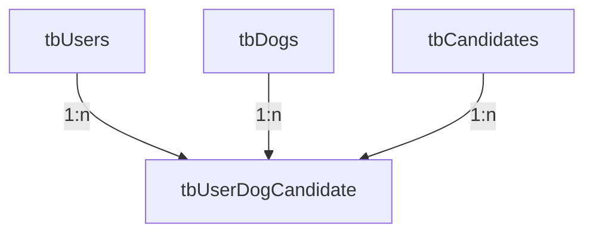

# BIO CAN  🐕🐾
## Tabla de contenidos

- [BIO CAN  🐕🐾](#patitas-felices--)
  - [Tabla de contenidos](#tabla-de-contenidos)
  - [Backend Equipos - Refugio Perros](#backend-equipos---refugio-perros)
    - [Proyecto por equipos Backend](#proyecto-por-equipos-backend)
      - [Refugio Perros (asociación)](#refugio-perros-asociación)
      - [Protectora Perros (proyecto web)](#protectora-perros-proyecto-web)
  - [Requisitos técnicos del proyecto](#requisitos-técnicos-del-proyecto)
  - [Orientación técnica del proyecto](#orientación-técnica-del-proyecto)
    - [Base de datos MySQL](#base-de-datos-mysql)

## Backend Equipos - Refugio Perros
### Proyecto por equipos Backend
#### Refugio Perros (asociación)
Página web de la asociación BIO CAN dedicada a la protección y reinserción de perros abandonados.

Primero, nos ocupamos de localizar, rescatar y salvar perros en situación de riesgo (perros perdidos, abandonados o maltratados).

Después nos ocupamos de su protección, cuidados, acogida y refugio. Se cubren sus necesidades de salud y bienestar, ofrenciendoles lo más parecido a un hogar.

Finalmente, cuando el perro recupera su salud y su equilibrio, se le busca un nuevo hogar donde mejor encaje dadas sus características y las características de su futura familia.

#### Protectora Perros (proyecto web)
El refugio PATITAS FELICES solicita una página web que cubra las siguientes necesidades:

## Requisitos técnicos del proyecto
El objetivo del proyecto es, en trabajo colaborativo, poner en práctica las siguientes técnicas de backend:

- Diseño bbdd MySQL en un contenedor Docker
- Creación de un proyecto backend con las siguientes tecnologías:
    - NodeJS como entorno de ejecución
    - ExpressJS como framework backend
    - NPM como gestor paquetes
- Puesta en práctica de los siguientes conceptos:
    - Middleware
    - Modelo Vista Controlador
    - Variables de entorno
    - Vistas
    - ORM
    - JWT
    - Cookies
    - Sesion

## Orientación técnica del proyecto

### Base de datos MySQL
Este es el esquema de la base de datos.

