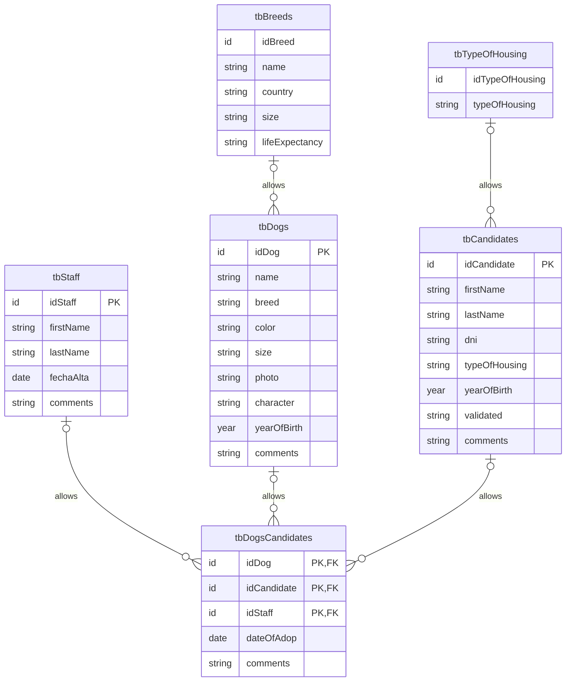

### Base de datos MySQL
Este es el esquema de la base de datos.

```mermaid
erDiagram
    tbBreeds |o--o{ tbDogs : allows
    tbBreeds {
        id idBreed
        string name
        string country
        string size
        string lifeExpectancy

    }
    tbTypeOfHousing |o--o{ tbCandidates : allows
    tbTypeOfHousing {
        id idTypeOfHousing
        string typeOfHousing
    }
    tbStaff |o--o{ tbDogsCandidates : allows
    tbStaff {
        id idStaff PK
        string firstName
        string lastName
        date fechaAlta
        string comments
    }
    tbDogs |o--o{ tbDogsCandidates : allows
    tbDogs {
        id idDog PK
        string name
        string breed
        string color
        string size
        string photo
        string character
        year yearOfBirth
        string comments
    }
    tbCandidates |o--o{ tbDogsCandidates : allows
    tbCandidates {
        id idCandidate PK
        string firstName
        string lastName
        string dni
        string typeOfHousing
        year yearOfBirth
        string validated
        string comments
    }
    tbDogsCandidates {
        id idDog PK, FK
        id idCandidate PK, FK
        id idStaff PK, FK
        date dateOfAdop
        string comments
    }

```
