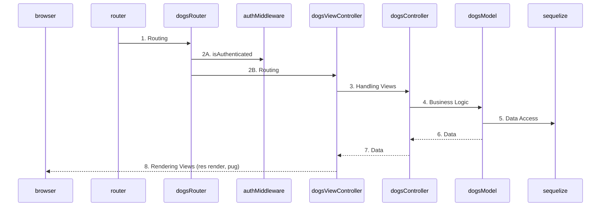
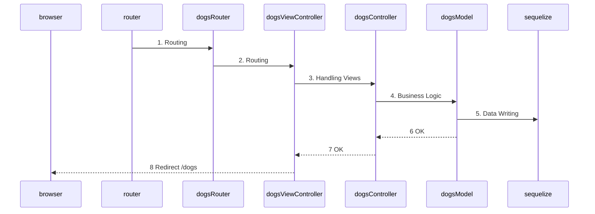

# Flujos del código
## Llamada a `localhost:3001/dogs`

1. Al ser `/dogs` `router.js` pasa la solicitud HTTP GET a `routerDogs.js`.
2. Dentro de `/dogs` es una solicitud a la raíz, por lo que:
a. llama a `authMiddleware.js` para comprobar si está autenticado.
b. en caso afirmativo, llama a `dogsViewController.js`
3. `dogsViewController.js` llama a `dogsContorller.js`
4. `dogsController.js` llama a `dogsModel.js`
5. `dogsModel.js` mediante el ORM **sequelize** saca los datos de la base de datos **MySQL**.
6. `dogsModel.js` pasa los datos a `dogsController.js`.
7. `dogsController.js` pasa los datos a `dogsViewController.js`.
8. `dogsViewController.js` renderiza la vista `list.pug` con los datos recibidos y el usuario los ve en el navegador.

## Crear un nuevo perro desde `localhost:3001/dogs/new`, después de  botón `Nuevo Perro`.

1. Desde `/dogs/new` pasa una solicitud HTTP POST de `router.js` a `roterDogs.js`.
2. Dentro de `/dogs` es una solicitud a la raíz, por lo que:
a. llama a `authMiddleware.js` para comprobar si está autenticado.
b. en caso afirmativo, llama a `dogsViewController.js`
3. `dogsViewController.js` llama a `dogsContorller.js` llamando al método CREATE.
4. `dogsController.js` llama a `dogsModel.js` mediante el método CREATE.
5. `dogsModel.js` mediante el ORM **sequelize** saca los datos de la base de datos **MySQL**.
6. `dogsModel.js` pasa los datos a `dogsController.js`.
7. `dogsController.js` pasa confirmación a `dogsViewController.js`.
8. `dogsViewController.js` nos redirige a `/dogs`.

